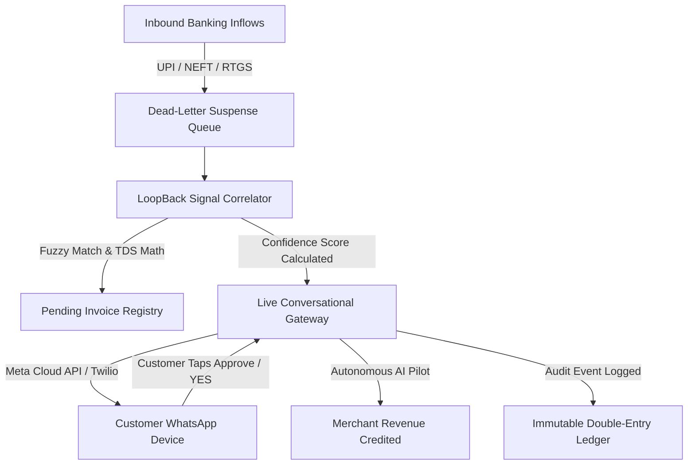

# LoopBack AI: Autonomous Dead-Letter Settlement Engine & Conversational Gateway

[](https://nextjs.org/)
[](https://fastapi.tiangolo.com/)
[](https://python.org/)
[](https://www.mysql.com/)
[](https://razorpay.com/)
[](https://business.whatsapp.com/)

> **Autonomous revenue recovery and conversational suspense clearance engine for Indian banking inflows (UPI, NEFT, RTGS, IMPS).**

---

## 📌 Executive Summary

In high-volume enterprise banking and merchant payouts, **1.2% to 4.5% of inbound transfers** fail automated straight-through processing due to:
1. **Missing or Truncated Virtual Account Numbers (VANs)** from legacy banking portals.
2. **Unannounced 2% TDS or GST Deductions** creating numeric amount mismatches.
3. **Typographical Errors** in remitter names across NEFT/RTGS clearing networks.

Traditionally, these funds sit frozen in a **Dead-Letter Suspense Ledger** for 30–90 days, requiring labor-intensive manual ticket audits.

**LoopBack AI solves this completely**:
- Correlates multi-factor signals (exact/split amounts, fuzzy remitter names, VAN prefixes, temporal proximity) in **< 0.4 seconds**.
- Reaches out autonomously to remitters via **WhatsApp Business Cloud API** in **8 Indian languages** with interactive approval cards.
- Autonomously settles the ledger upon remitter confirmation, credits merchant revenue, and records an immutable double-entry audit trail.

---

## 🚀 One-Command Quickstart for Evaluators

LoopBack AI is 100% plug-and-play. Evaluators only need to run:

```bash
# 1. Clone Repository
git clone https://github.com/prathameshtirmare/loopback-ai.git
cd loopback-ai

# 2. Install Dependencies
npm install
npm install --prefix frontend
pip install -r backend/requirements.txt

# 3. Launch Platform (Auto-connects Database, Seeds Accounts & Opens Browser)
npm run start
```

Your default browser will automatically open to **`http://localhost:3000`** with the full dashboard ready!

---

## ⚡ 1-Click Evaluator Passports (Zero Manual Typing)

On the login screen, evaluators can click any of the **5 Pre-Configured Passports** to sign in instantly:

| Passport / Role | Employee ID | Default Email | Password | System Access Level |
| :--- | :--- | :--- | :--- | :--- |
| 👑 **Prathamesh Tirmare** | `EMP-888` | `prathamesh@loopback.ai` | `Prathamesh@04` | **Admin / Lead System Architect** (Full root permissions) |
| 🏦 **Aarav Sharma** | `EMP-101` | `aarav.sharma@loopback.ai` | `Tester@101` | **Treasury Auditor** (Suspense ledger & audit export) |
| 💼 **Ananya Sen** | `EMP-102` | `ananya.sen@loopback.ai` | `Tester@102` | **Merchant Operations Lead** (Settlement batch execution) |
| 🛡️ **Rohan Kapoor** | `EMP-103` | `rohan.kapoor@loopback.ai` | `Tester@103` | **Risk & Compliance Officer** (Ledger governance & freeze) |
| ⚖️ **Priya Nair** | `EMP-104` | `priya.nair@loopback.ai` | `Tester@104` | **Reconciliation Specialist** (Manual carrier overrides) |

---

## 🕹️ Complete Button-by-Button & Feature Tour

### 1. Header & Navigation Controls
- **`AI Pilot Switch (AUTONOMOUS / MANUAL REVIEW)`**: 
  - **`AUTONOMOUS (ON)`**: When the customer taps *Approve* or replies *YES*, the autonomous agent instantly settles the payment, credits merchant revenue, and logs the receipt with zero human latency.
  - **`MANUAL REVIEW (OFF)`**: Customer confirmations are queued for staff review, unlocking visual `Approve & Transfer` / `Approve & Refund` action buttons in the chat drawer.
- **`Demo Cases: TDS 2% Inflow`**: Injects a complex dead-letter transaction where the customer deducted 2% Section 194C TDS (e.g. transferred ₹49,000 against a ₹50,000 invoice). Demonstrates the agent's mathematical tax-split resolution.
- **`Demo Cases: Fuzzy VAN`**: Injects an inflow where the banking remittance truncated the Virtual Account number (e.g. `RAZR_UNMAPPED_...`). Demonstrates fuzzy entity correlation.
- **`Upload CSV`**: Allows uploading custom bank statement CSVs for bulk ingest.
- **`Audit Trail`**: Opens the tamper-proof ledger ([`/audit-trail`](http://localhost:3000/audit-trail)) recording timestamps, actions, performed-by actors, and settlement amounts.
- **`System Guide (ⓘ)`**: Opens the interactive architectural guide ([`/guide`](http://localhost:3000/guide)).
- **`Pair Test Phone`**: Allows evaluators to enter their personal mobile number to route live interactive settlement cards to their physical device during testing.
- **`Execute AI Recovery Batch`**: Runs the global correlation pass across all pending dead-letter items.

---

### 2. Dead-Letter Suspense Queue (Left Panel)
- **`Search Input`**: Real-time filtering by Remitter Name, UTR Number, or Phone.
- **`Ledger Tabs (Active Suspense / Settled & Cleared / All)`**: Toggles between pending dead-letter items and cleared transactions.
- **`Signal Confidence Score (% Badge)`**: Multi-factor match probability calculated by the heuristic engine.
- **`Open Live Gateway`**: Loads the active conversational drawer for that specific suspense transaction.

---

### 3. Live Carrier Gateway (Right Panel)
- **`Live WhatsApp Stream Synchronized Badge`**: Real-time carrier link indicator.
- **`Re-Send WhatsApp Alert`**: Re-dispatches the official verification prompt if the remitter deleted or cleared their chat.
- **`Chat Stream Interface`**: Shows the chronological dialogue between the customer and LoopBack AI.
- **`Staff Reply Input & Send Button`**: Enables internal operators to send direct messages to the customer's device.

---

## 🧠 Autonomous Signal Scoring Engine

When an unmatched transaction arrives, LoopBack AI compares it against pending unpaid invoices across 4 weighted vectors:

$$\text{Confidence Score} = (0.40 \times S_{\text{amount}}) + (0.30 \times S_{\text{remitter}}) + (0.20 \times S_{\text{van}}) + (0.10 \times S_{\text{time}})$$

1. **Exact / TDS Amount Match ($40\%$)**: Exact amount match or mathematical 2% / 10% TDS tax deduction split.
2. **Fuzzy Remitter Match ($30\%$)**: Levenshtein distance and token-set ratio between sender name and invoice customer name.
3. **Virtual Account Prefix ($20\%$)**: Correlation of unmapped or truncated VAN strings.
4. **Temporal Proximity ($10\%$)**: Proximity between transaction receipt timestamp and invoice due date.

---

## 🌐 Multi-Lingual NLP Engine (8 Indian Languages)

LoopBack AI autonomously detects and converses in 8 regional languages:

| Language | Approval Keywords | Rejection Keywords | Regional Greeting Example |
| :--- | :--- | :--- | :--- |
| **English** | `YES`, `Approve`, `Confirm`, `1` | `NO`, `Reject`, `Refund`, `2` | *"Razorpay Payment Alert: Hello..."* |
| **Marathi (मराठी)** | `होय`, `मंजूर`, `हो` | `नाही`, `रद्द`, `परत` | *"रेझरपे पेमेंट सूचना: नमस्कार..."* |
| **Hindi (हिन्दी)** | `हाँ`, `स्वीकार`, `हा` | `नहीं`, `अस्वीकार`, `वापस` | *"रेज़रपे भुगतान सूचना: नमस्ते..."* |
| **Gujarati (ગુજરાતી)** | `હા`, `મંજૂર` | `ના`, `રદ`, `પાછા` | *"રેઝરપે ચુકવણી ચેતવણી: નમસ્તે..."* |
| **Tamil (தமிழ்)** | `ஆம்`, `ஒப்புதல்` | `இல்லை`, `நிராகரி` | *"ரேஸர்பே கட்டண எச்சரிக்கை: வணக்கம்..."* |
| **Telugu (తెలుగు)** | `అవును`, `ఆమోదించు` | `కాదు`, `తిరస్కరించు` | *"రేజర్‌పే చెల్లింపు హెచ్చరిక: నమస్కారం..."* |
| **Kannada (ಕನ್ನಡ)** | `ಹೌದು`, `ಒಪ್ಪಿಗೆ` | `ಇಲ್ಲ`, `ತಿರಸ್ಕರಿಸಿ` | *"ರೇಜರ್‌ಪೇ ಪಾವತಿ ಎಚ್ಚರಿಕೆ: ನಮಸ್ಕಾರ..."* |
| **Bengali (বাংলা)** | `হ্যাঁ`, `অনুমোদন` | `না`, `বাতিল` | *"রেজারপে পেমেন্ট সতর্কতা: নমস্কার..."* |

---

## 🏗️ Technical Architecture



---

## 📁 Repository Structure

```text
loopback-ai/
├── backend/
│   ├── app/
│   │   ├── db/
│   │   │   ├── database.py         # MySQL connection with SQLite fallback
│   │   │   └── seed_data.py        # 5 Tester passports & suspense scenarios
│   │   ├── models/
│   │   │   └── schema_models.py    # SQLAlchemy models & audit logs
│   │   └── services/
│   │       ├── auth.py             # JWT authentication & password hashing
│   │       ├── notifier.py         # Live carrier dispatcher
│   │       └── agent.py            # Signal correlation scoring engine
│   ├── main.py                     # FastAPI application & webhook endpoints
│   └── requirements.txt            # Python dependencies
├── frontend/
│   ├── src/
│   │   └── app/
│   │       ├── page.tsx            # Main settlement dashboard & live gateway
│   │       ├── audit-trail/        # Immutable double-entry ledger page
│   │       └── guide/              # Interactive system guide & architecture
│   ├── package.json
│   └── tailwind.config.ts
├── launch.js                       # Zero-setup cross-platform browser launcher
├── package.json                    # Root launcher scripts
└── README.md                       # Comprehensive documentation
```

---

## 🔒 Security & Enterprise Governance
- **Double-Entry Ledger Integrity**: Every automated credit release creates reciprocal debit/credit entries.
- **Role-Based Access Control (RBAC)**: Enforced via cryptographic RS256/HS256 JWT tokens.
- **Interactive Decision Lock**: In-memory and database locks prevent duplicate settlement execution on high-concurrency replays.
- **Fail-Safe Self-Healing**: Database engine automatically starts MySQL service with automatic fallback to embedded SQLite.

---

## 👥 Lead Authors
- **Prathamesh Tirmare** — *Lead Architect & Full-Stack Engineer* (prathamesh@loopback.ai)

*Built for the Razorpay Innovation & Autonomous Settlement Challenge.*
